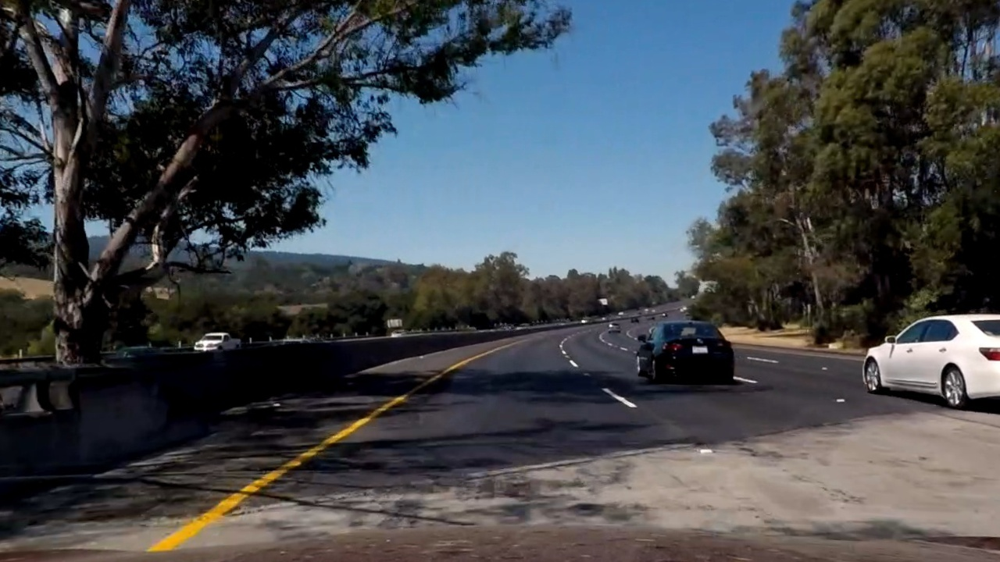
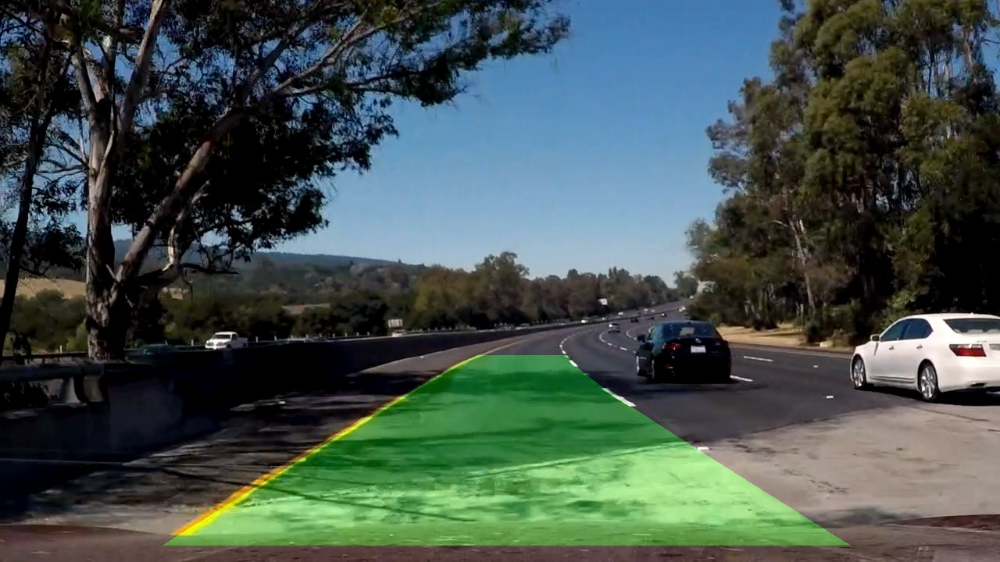

# PROJECT ADVANCED LANE FINDING #

## OBJECTIVE ##

This project is the udacity advanced lane finding project. The objective of this project is to find the lane lines on the road using advance yet effective camera image processing methodologies.

## STEPS ##

1. Calibrate the image using given chessboard images.
1. perform image distortion correction based on calibration matrix.
1. Perform color and gradient transformation to create a thresholded binary image.
1. Apply a birds eye view perspective transform to view the lines as parallel lines.
1. Detect lane pixels and fit to find the lane boundary.
1. Determine the curvature of the lane and vehicle position with respect to center.
1. Warp the detected lane boundaries back onto the original image.
1. Output visual display of the lane boundaries and numerical estimation of lane curvature and vehicle position.

## [Rubric](https://review.udacity.com/#!/rubrics/571/view) Points
###Here I will consider the rubric points individually and describe how I addressed each point in my implementation.  

---
###Writeup / README

####1. Provide a Writeup / README that includes all the rubric points and how you addressed each one.  You can submit your writeup as markdown or pdf.  [Here](https://github.com/udacity/CarND-Advanced-Lane-Lines/blob/master/writeup_template.md) is a template writeup for this project you can use as a guide and a starting point.  

You're reading it!
###Camera Calibration

####1. Briefly state how you computed the camera matrix and distortion coefficients. Provide an example of a distortion corrected calibration image.

The code for this step is contained in the **find_corners** and **undistort_image** of the IPython notebook located in "Project-Advanced-lane-finding.ipynb".

I start by preparing "object points", which will be the (x, y, z) coordinates of the chessboard corners in the world. Here I am assuming the chessboard is fixed on the (x, y) plane at z=0, such that the object points are the same for each calibration image.  Thus, `objp` is just a replicated array of coordinates, and `objpoints` will be appended with a copy of it every time I successfully detect all chessboard corners in a test image.  `imgpoints` will be appended with the (x, y) pixel position of each of the corners in the image plane with each successful chessboard detection.  

I then used the output `objpoints` and `imgpoints` to compute the camera calibration and distortion coefficients using the `cv2.calibrateCamera()` function.  I applied this distortion correction to the test image using the `cv2.undistort()` function and obtained this result: 


###Pipeline (single images)

####1. Provide an example of a distortion-corrected image.
To demonstrate this step, I will describe how I apply the distortion correction to one of the test images like this one:




####2. Describe how (and identify where in your code) you used color transforms, gradients or other methods to create a thresholded binary image.  Provide an example of a binary image result.
I used a combination of color and gradient thresholds to generate a binary image as called out in **color_thresholding** and **abs_sobel_thresholding** functions in the same ipynb. I tried a few color spaces and thresholdings, including l and s thresholds in HLS color space, s and v thresholds in HSV color space, L and b thresholds in LAB color space. I found that the L and b thresholds worked best for me. b is amazing to identify the yellow lines, though I am still struggling a bit with shadows from trees. I combined the L and b combined color image to a sobel x transform to acheive good identification of both left and right lines. Here's an example of my output for this step.


####3. Describe how (and identify where in your code) you performed a perspective transform and provide an example of a transformed image.

The code for my perspective transform includes a function called `perspective_transform()`, which appears in the file `Project-Advanced-lane-finding.ipynb.ipynb`.  The `perspective_transform()` function takes as inputs an image (`img`), as well as camera matrix (`mtx`) and distortion coefficients (`dist`). The function outputs the warped image (`warped`) a transformation matrix (`M`) and an inverse transformation matrix (`Minv`) to go back to normal view from birds eye view. I chose to hardcode the source and destination points in the following manner:

```
top_right_src = [585. /1280.*img_size[0], 455./720.*img_size[1]]
top_left_src = [705. /1280.*img_size[0], 455./720.*img_size[1]]
bottom_right_src = [1270./1280.*img_size[0], 700./720.*img_size[1]]
bottom_left_src = [190. /1280.*img_size[0], 700./720.*img_size[1]]

src = np.float32([
   top_right_src, # top right
   bottom_right_src, # bottom right
   bottom_left_src, # bottom left
   top_left_src # top left
])
    
top_right_dest = [300. /1280.*img_size[0], 0./720.*img_size[1]]
top_left_dest = [1000./1280.*img_size[0], 0./720.*img_size[1]]
bottom_right_dest = [1000./1280.*img_size[0], 720./720.*img_size[1]]
bottom_left_dest = [300. /1280.*img_size[0], 720./720.*img_size[1]]
    
dst = np.float32([
   top_right_dest, # top right
   bottom_right_dest, # bottom right
   bottom_left_dest, # bottom left
   top_left_dest # top left
])
```
This resulted in the following source and destination points:

| Source        | Destination   | 
|:-------------:|:-------------:| 
| 585, 455      | 300, 0        | 
| 705, 455      | 1000, 0      |
| 1270, 700     | 1000, 720      |
| 190, 700      | 300, 720        |

I verified that my perspective transform was working as expected by drawing the `src` and `dst` points onto a test image and its warped counterpart to verify that the lines appear parallel in the warped image.


####4. Describe how (and identify where in your code) you identified lane-line pixels and fit their positions with a polynomial?

The **find_lane** function in my jupyter notebook is the implementatino to detect lane line pixels. The algorithm closely follows the udacity classroom notes. The first step is to compute a histogram of the bottom half of the the warped image. It will theoritically have 2 prominent peaks that correspond to the left and right lane lines. I identify the index of the peak left-lane marker by using the `np.argmax()` function on the left half of the histogram.  I perform the same task for the right lane by processing the right half of the histogram. I use a search window approach to detect follow the lane line pixels. There are 9 windows, each window height is **image size/number of windows** and width of **100**. The algorithm then steps through the windows one by one in order to find the number of pixels inside the window boundaries. If the pixel numbers within a window is greater than the minimum number **50**, then the next window is recentered around the mean position of current pixels.

The output of all this is a set of **(x,y)** values, the windows are drawn over the image and a ploynomial equation is used to fit the lines. This is depicted as a yellow line on the image.


####5. Describe how (and identify where in your code) you calculated the radius of curvature of the lane and the position of the vehicle with respect to center.

I did this in my Jupyter Notebook in the functions `measure_curvature`. I computed the lane curvature in real-space (meters) by accepting an input to the variable `pixel` as `false` and in pixel space (pixels) using the input to the same variable as `True`.


####6. Provide an example image of your result plotted back down onto the road such that the lane area is identified clearly.

I implemented this step in the `draw_lines_on_road` function.  Here is an example of my result on a test image:



---

###Pipeline (video)

####1. Provide a link to your final video output.  Your pipeline should perform reasonably well on the entire project video (wobbly lines are ok but no catastrophic failures that would cause the car to drive off the road!).

Here's an example of what my pipeline would output on an image:


Here's a [link to my video result](Project_video_output.mp4)

---

###Discussion

####1. Briefly discuss any problems / issues you faced in your implementation of this project.  Where will your pipeline likely fail?  What could you do to make it more robust?

This project was a very interesting project since it needed a lot of fine tuning of parameters. I created 2 python notebooks because at one point I had tweaked my parameters a lot that I lost track and had to restart :). 

Once the pipeline was tweaked and performing well on the test images, I tested it out on the project_video.mp4 video and it performed well on this video as well. However, I did observe that the lane prediction was challenged when a shadow was introduced on the road. So I tried running the pipeline on only this frame and fair enough the lane prediction was off.

I noticed that on the Challenge_video.mp4, there was a line in the middle of the lane, this would threw the lane predition off. The harder_challenge_video.mp4 vidwo had a lot of reflections and shadows which completely threw the prediction algorithm off. Some sort of shaddow correction, reflection correction and filter for lane prediction needs to be implemented that are more robust.